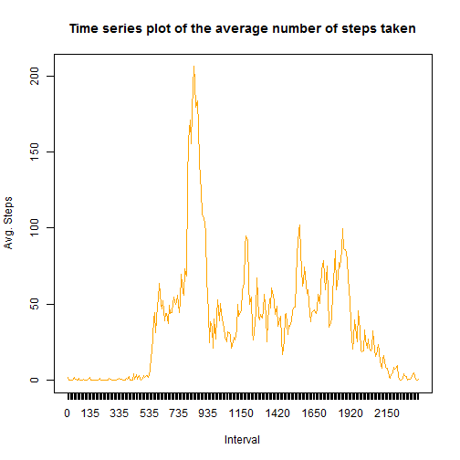
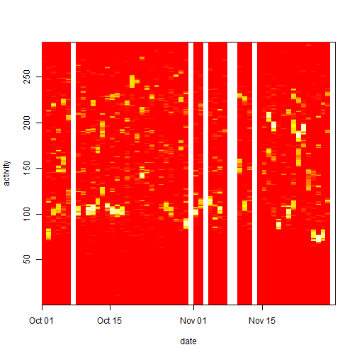

# Reproducible Assignment


This assignment makes use of data from a personal activity monitoring device. This device collects data at 5 minute intervals through out the day. The data consists of two months of data from an anonymous individual collected during the months of October and November, 2012 and include the number of steps taken in 5 minute intervals each day.


The data for this assignment was obtained from course web site:
[Activity monitoring data](https://d396qusza40orc.cloudfront.net/repdata%2Fdata%2Factivity.zip)


### Get the data
The zip file was downloaded, using the code below  
Code for reading in the dataset and/or processing the data

```r
download.file(
    url="https://d396qusza40orc.cloudfront.net/repdata%2Fdata%2Factivity.zip", 
    destfile = "activity.zip")
```


```r
options(scipen = 10)
unzip("activity.zip")
activity <- read.csv( "activity.csv",  stringsAsFactors = FALSE, na.strings = c("NA"))
```

The dates will now have to be converted into the date classes so that they are able
to fill x-axis later. The axis labels of x axis are set vertical to fit in graph.

```r
activity$date <- as.Date(activity$date, "%Y-%m-%d")
```


Histogram of the total number of steps taken each day

```r
day.wise.steps <- tapply(activity$steps, activity$date, sum, na.rm=TRUE)
range.steps <- split(as.integer(day.wise.steps), 
                     cut(as.integer(day.wise.steps), 10, dig.lab = 10))
x <- sapply(range.steps, length)
par(mar=c(8,1,1,1))
barplot(x,col="lavender",las=3, ylab="Frequencies", main="histogram of steps per day")
```


From the data we can calculate that the mean of steps taken per day = __9354.2295082__ and median = __10395__.


Time series plot of the average number of steps taken  
This can be obtained by calling a combination of tapply and plot functions.

```r
avg.daily.steps <- as.data.frame(as.table(tapply(activity$steps, activity$interval, mean, na.rm=TRUE)))
colnames(avg.daily.steps) <- c("Interval","AvgSteps")
plot(x=avg.daily.steps$Interval, y=avg.daily.steps$AvgSteps,
     main="Time series plot of the average number of steps taken" ,
     xlab="Interval", ylab="Avg. Steps")
```




The 5-minute interval that, on average, contains the maximum number of steps
Now we will have to find average of steps per interval. time to call tapply again.
Only this time, groups will be formed w.r.t interval


```r
avg.interval.steps <- as.data.frame(
    as.table(tapply(activity$steps, activity$interval, mean, na.rm=TRUE)))
colnames(avg.interval.steps) <- c("Interval","AvgSteps")
most.active.interval <- avg.interval.steps$Interval[
    avg.interval.steps$AvgSteps == max(avg.interval.steps$AvgSteps)]
```
As we can see that highest number of steps were recorded in the __835__ interval. 


Code to describe and show a strategy for imputing missing data  

__15.0943396%__ of the values are missing.
Let's see the pattern of the missing values.

```r
missing.values <- tapply(activity$steps,
                         format(activity$date, "%a-%d/%m"),
                            function(x)sum(is.na(x)))
ylim=range(missing.values)
#will remove all the dates with no missing values
missing.values <- missing.values[-which(missing.values == 0)]
barplot(missing.values,ylim=ylim, las=3 ,col="pink")
```


So, we see that the collection was not done on few days. But on the other days it was done diligently.


A quick strategy to input the missing data could be to put average of that interval for the missing value. But in practicality, routine of most people tend to stay same for the day of the week. Hence , We should calculate average steps per interval for each day of the week.

So, Lets draw a heat map of the activity.  

#### A heat map of activity with intervals laid on y-axis and days on x-axis

```r
activity$interval <- as.factor(activity$interval)
z <- matrix(activity$steps[order(activity$date,activity$interval)], nrow=length(unique(activity$date)), ncol=nlevels(activity$interval), byrow = TRUE)
dimnames(z)[[1]] <- format(sort(unique(activity$date)),"%a-%d/%m")
dimnames(z)[[2]] <- levels(activity$interval)
image(z, x=sort(unique(activity$date)), y=seq_len(nlevels(activity$interval)), xlab="date", ylab="activity")
```



By looking at the heatmaps, There doesn't seems to be any correlation between the consectutive
days. Perhaps subjects follow a routine across a week. i.e. swimming on Monday, sauna on Sunday etc.
To find this information we will have to correlate the activity on a weekday across all weeks.

#### A per-weekday heat map of activity with intervals laid on x-axis and week number on y-axis

```r
activity$weekNum <- as.factor(format(activity$date,"%U"))
activity$weekday <- factor(
                            format(activity$date,"%a"), 
                            labels=c("Mon","Tue","Wed","Thu", "Fri", "Sat", "Sun")
                            )
par(mfrow=c(3,3),mar=c(2,2,2,2))
for ( weekD in levels(activity$weekday)) {
    act <- subset(activity, weekday == weekD) 
    act <- act[order(act$weekNum, act$interval),]
    z  <- matrix(act$steps,ncol=length(unique(act$weekNum)) ,nrow=nlevels(act$interval))
    dimnames(z)[[1]] <- sort(unique(act$interval))
    dimnames(z)[[2]] <- sort(unique(act$weekNum))
    image(z=z,col=heat.colors(512),main=weekD, y=as.numeric(dimnames(z)[[2]]), x=seq_len(nlevels(act$interval)))
}
```


So, we see faint patterns indicated by streaks of yellow. This is being followed across weeks for each weekday.

> Hence the strategy to input the missing data should be to insert the average of the activity for that interval from other same weekdays.

Let's first make a dataset of the filler values and add a new column *"nonNASteps"* will all non NA values

```r
filler.values <- tapply(activity$steps,list(activity$weekday, activity$interval)
                        , mean, na.rm=T)
nonNASteps <- sapply(seq_len(nrow(activity)), 
                function(x){
                    if(is.na(activity[x,"steps"]))
                        filler.values[activity[x,"weekday"], activity[x, "interval"]] 
                    else
                        activity[x,"steps"]})
activity$nonNASteps <- nonNASteps
```

Histogram of the total number of steps taken each day

```r
day.wise.steps <- tapply(activity$nonNASteps, activity$date, sum)
range.steps <- split(as.integer(day.wise.steps), 
                     cut(as.integer(day.wise.steps), 10, dig.lab = 10))
x <- sapply(range.steps, length)
par(mfrow=c(1,1), mar=c(8,1,1,1))
barplot(x,col="lavender",las=3, ylab="Frequencies",
        main="histogram of steps per day")
```


From the data we can calculate that the mean of steps taken per day = __10821.2096019__ and median = __11015__.

> So filling up the missing values has increased the mean and median. 
This is reasonable since Monday is the day having highest activity and we had two Mondays missing from the data.


```r
c(
    "Steps/day(avg)"=mean(activity$steps, na.rm=T),
    tapply(activity$steps,list(activity$weekday), mean, na.rm=T)
)
```

```
## Steps/day(avg)            Mon            Tue            Wed            Thu 
##       37.38260       42.91567       34.63492       43.52579       42.63095 
##            Fri            Sat            Sun 
##       28.51649       31.07485       40.94010
```
Understand that there are 288 intervals in a day. The missing values per weekday look like below

```r
table(format(activity[is.na(activity$steps),"date"],"%a-%d/%m"))
```

```
## 
## Fri-09/11 Fri-30/11 Mon-01/10 Mon-08/10 Sat-10/11 Sun-04/11 Thu-01/11 
##       288       288       288       288       288       288       288 
## Wed-14/11 
##       288
```


#### Are there differences in activity patterns between weekdays and weekends?
Let's mark the weekdays and weekends separately. For this we introduce a new column in the data frame, *dayType*


#### Panel plot containing a time series plot (i.e. type = "l") of the 5-minute interval (x-axis) and the average number of steps taken, averaged across all weekday days or weekend days (y-axis). 

```r
activity$dayType <- numeric(nrow(activity))
activity$dayType[ as.numeric(activity$weekday) < 6 ] <- "WeekDay"
activity$dayType[ as.numeric(activity$weekday) >= 6 ] <- "WeekEnd"
activity$dayType <- as.factor(activity$dayType)
time.series.by.dayType <- as.data.frame(as.table(tapply(activity$steps, list(activity$dayType,activity$interval), mean, na.rm=T)))
colnames(time.series.by.dayType) <- c("daytype", "interval", "steps")
xyplot(
    log10(steps)~as.integer(as.character(interval))|daytype, 
    data=time.series.by.dayType, type="l", layout=c(1,2), 
    ylab = "", main="steps taken on logarithmic scale", 
    xlab="interval"
    )
```


***

